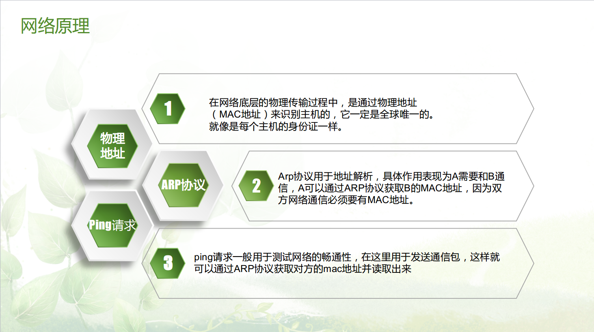
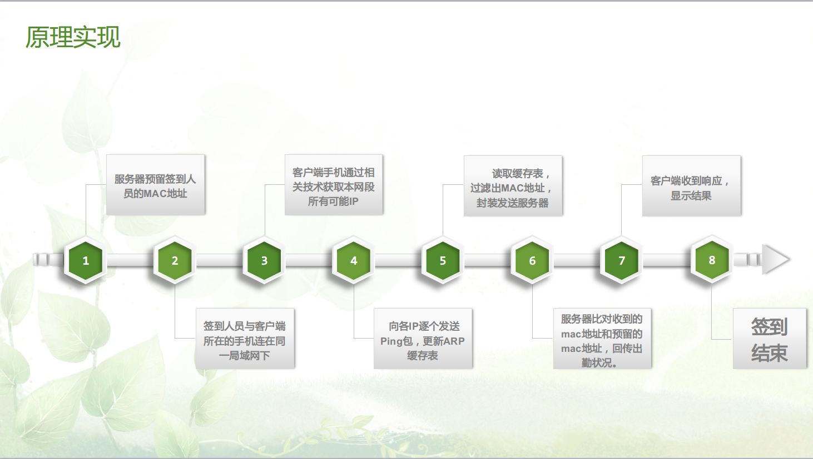

# check
### 项目简介
这个是本人初学java时使用spring-boot搭建的一个项目,主要是解决这样一个需求，使用手机的MAC地址进行上课时的签到。
### 签到原理
我们都知道手机有无线网卡，每个网卡都有一个固定的mac地址，在数据链路层标识唯一的主机，那么这个地址就可以作为标识来进行签到.具体的签到流程见下图:

整个过程如上图所示，目前来说只试验过小范围局域网签到，更大的范围还未尝试过，虽然技术还不成熟，但是使用手机网卡的mac地址作为唯一标识来签到无疑是不错的想法，值得实践。本项目是签到系统的服务器端，客户端是安卓项目，双方使用json通信。

### 技术路线

- 框架:springboot,maven
- 数据库访问:spring-data-jpa,mysql
- 前台:thymeleaf,html,bootstrap
- android